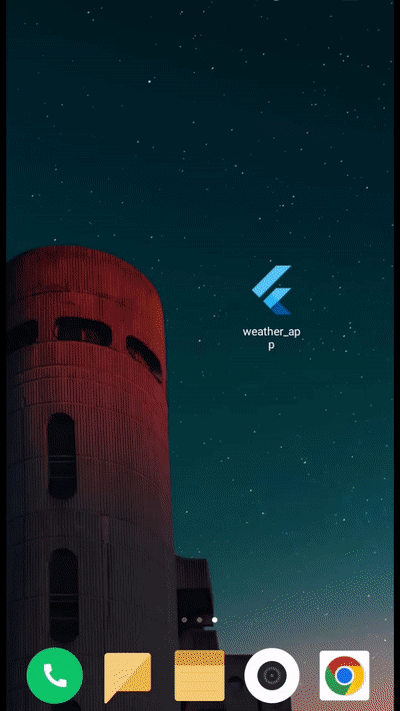

# Weather app with Flutter bloc

  
 
 
### Review

   

### Packages we are using:

[flutter_bloc :](https://pub.dev/packages/flutter_bloc)  Widgets that make it easy to integrate blocs and cubits into [Flutter](https://flutter.dev/). Built to work with [package:bloc](https://pub.dev/packages/bloc). The Bloc library provides very good 🦄 tooling and compared to other state management solutions that use Streams, it's a pure gem.

[equatable:](https://pub.dev/packages/equatable) Being able to compare objects in `Dart` often involves having to override the `==` operator as well as `hashCode`.

geolocator:- [Link:](https://pub.dev/packages/geolocator) Geolocation plugin for Flutter. This plugin provides a cross-platform (iOS, Android) API for generic location (GPS etc.) functions.

shared_preferences:- [Link:](https://pub.dev/packages/shared_preferences) Flutter plugin for reading and writing simple key-value pairs. Wraps NSUserDefaults on iOS and SharedPreferences on Android.

intl:- [Link:](https://pub.dev/packages/agora_rtc_engine) Contains code to deal with internationalized/localized messages, date and number formatting and parsing, bi-directional text, and other internationalization issues.

    
### Created & Maintained By

[@aibekdv](https://github.com/aibekdv)
